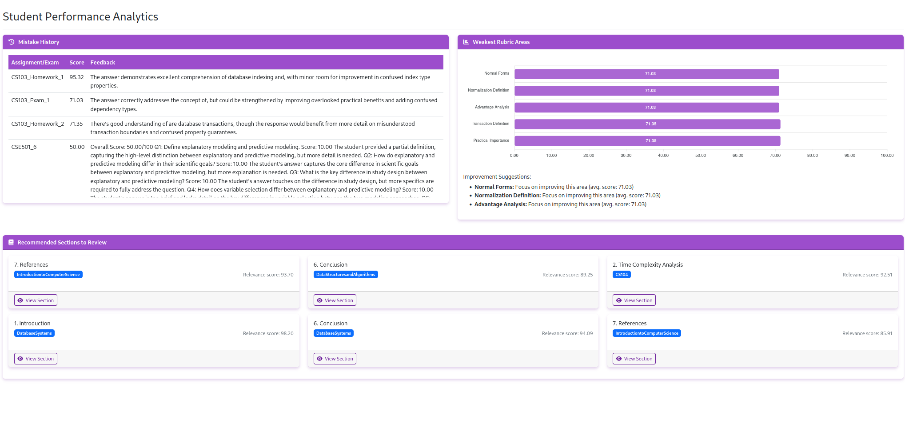
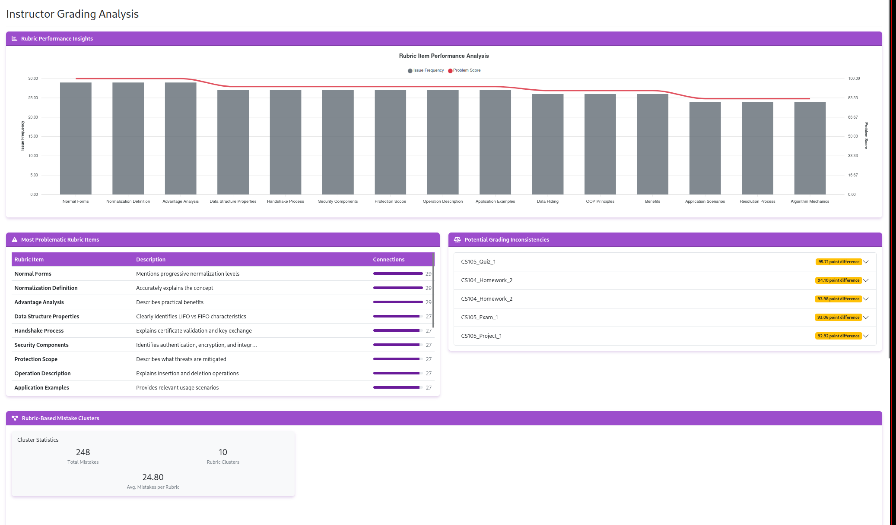

# Educational Network Analysis Dashboard

A Django-based dashboard for visualizing and analyzing educational networks among students, instructors, and courses.

## Features

- **Data Simulation**: Generate realistic educational data with students, instructors, courses, and assessments
- **Network Analysis**: Use network theory to model relationships between educational entities
- **Interactive Visualizations**: Explore network graphs, performance metrics, and educational analytics
- **Detailed Profiles**: View comprehensive profiles for students, instructors, and courses
- **Performance Analytics**: Analyze academic performance across various dimensions

## Screenshot




## Installation

1. **Clone the repository**:
   ```bash
   git clone <repository-url>
   cd network-project
   ```

2. **Create a virtual environment**:
   ```bash
   python -m venv venv
   source venv/bin/activate  # On Windows, use: venv\Scripts\activate
   ```

3. **Install dependencies**:
   ```bash
   pip install -r requirements.txt
   ```

4. **Run database migrations**:
   ```bash
   cd aniTA_web
   python manage.py makemigrations network_simulation
   python manage.py migrate
   ```

5. **Generate sample data**:
   ```bash
   python manage.py shell
   ```
   
   Then in the Python shell:
   ```python
   from network_simulation.generate_data import generate_data
   from network_simulation.import_data import import_from_json
   
   # Generate data
   data = generate_data()
   
   # Save to JSON
   import json
   with open('network_data.json', 'w') as f:
       json.dump(data, f)
   
   # Import into database
   import_from_json('network_data.json')
   
   exit()
   ```

6. **Run the development server**:
   ```bash
   python manage.py runserver
   ```

7. **Access the dashboard**:
   Open your browser and navigate to: http://127.0.0.1:8000/network/

## Project Structure

- `aniTA_web/` - Main Django project directory
  - `network_simulation/` - Educational network analysis app
    - `models.py` - Database models
    - `views.py` - Dashboard views
    - `network_analysis.py` - Network algorithms and analysis functions
    - `generate_data.py` - Data simulation script
    - `import_data.py` - Script to import simulated data
    - `templates/` - HTML templates for the dashboard
    - `urls.py` - URL routing

## Requirements

- Python 3.8+
- Django 4.0+
- NetworkX 2.8+
- Matplotlib 3.5+
- NumPy 1.21+
- Pandas 1.3+

## Integration with Main Project

To integrate this app with your existing Django project:

1. Copy the `network_simulation` directory to your Django project directory
2. Add 'network_simulation' to your INSTALLED_APPS in settings.py
3. Include the URLs in your project's urls.py:

```python
urlpatterns = [
    # ... other URL patterns
    path('network/', include('network_simulation.urls')),
]
```

## Dashboard Views

- **Main Dashboard**: Overview of network stats and key metrics
- **Student-Instructor Network**: Analyze relationships between students and instructors
- **Course Network**: Explore connections between courses based on shared students
- **Student Performance**: Analyze academic performance patterns
- **Detail Views**: In-depth profiles for individual students, instructors, and courses

## Extending the Project

This dashboard can be extended in several ways:

1. **Real Data Integration**: Replace simulated data with real educational data from your institution
2. **Additional Metrics**: Implement more advanced network metrics for deeper analysis
3. **Predictive Analytics**: Add machine learning models to predict student performance
4. **Time-Series Analysis**: Extend the model to track changes in the network over time
5. **Interactive Graphs**: Enhance the dashboard with D3.js or similar for more interactive visualizations

## License

[MIT License](LICENSE)
